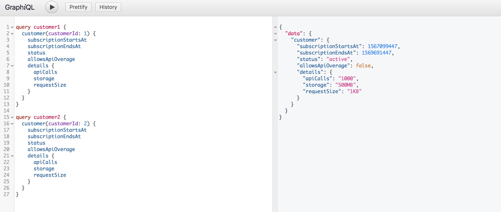

# Customer Usage Data Service

## Description

This service provide a GraphQL api querying subscription data about a customer. This minimal product supports
searching for customer subscription data and the usage details. 

## Requirements

* PyCharm - or your favorite IDE.
* Docker/Docker Compose - for running Neo4J container.
* Python 3.7
* Pipenv - virtual environment and dependency manager.
* Bash - scripts and command execution.

## Executions

Most required commands has been wrapped and included in the **build.sh** file 

1. **View available commands** 

    ```bash
    ./build.sh
    ```

2. **Prepare your environment** 
  
    If you have a recent version of pip installed. So you may have to downgrade. If you get the following error you can resolve it using the following
    command:

    ```bash
    ./build.sh py37setup
    ```

    Error from higher version of pip:
    ```
      env/utils.py", line 402, in resolve_deps
        req_dir=req_dir
        File "/usr/local/lib/python3.7/site-packages/pipenv/utils.py", line 250, in actually_resolve_deps
          req = Requirement.from_line(dep)
        File "/usr/local/lib/python3.7/site-packages/pipenv/vendor/requirementslib/models/requirements.py", line 704, in from_line
          line, extras = _strip_extras(line)
      TypeError: 'module' object is not callable
    ``` 
    

3. **Start Neo4j container**

    In another terminal start the Neo4j database. 
    
    ```bash
    docker-compose up
    ```

4. **Install dependencies and run test** 

    ```bash
    ./build.sh install-test
    ```

5. **Continuously run test**

    ```bash
    ./build.sh test
    ```

6. **Start server**

    ```bash
    ./build.sh run-local
    ```

7. **Access the endpoint**

    For running queries.

    http://localhost:9090/api/customer

8. **Build Image**
    ```bash
    ./build.sh build-image
   ```    
8. **Run Image**
    ```bash
    ./build.sh run-image
   ```    
   
8. **Remove Container**
    ```bash
    ./build.sh remove-customer-service 
   ```    
## Data
  
### Model

Here we define some of the assumptions we make about the data, and its semantics.
This is just a contrived model with made up data to be able to answer some of the questions about a
person's relationship and their family tree. 

1. **Customer Result Schema:** 
    
    A sample of the customer usage data is represented by the document shown below:
    
    ```json
       {
          "data": {
            "customer": {
              "subscriptionStartsAt": 1567099447,
              "subscriptionEndsAt": 1569691447,
              "status": "active",
              "allowsApiOverage": false,
              "details": {
                "apiCalls": "1000",
                "storage": "500MB",
                "requestSize": "1KB"
              }
            }
          }
        }
    ```
       
## User Interface

The application use  **GRAPHIQL** interface that makes it easy to execute graphql
queries and mutations. The interface also allows you to store command by name. More 
examples are present in the file **sample_executions.txt**. The file contains both valid and invalid
queries to test the rules of our system. 




Sample Valid Query:
```
query customer1 {
  customer(customerId: 1) {
    subscriptionStartsAt
    subscriptionEndsAt
    status
    allowsApiOverage
    details {
      apiCalls
      storage
      requestSize
    }
  }
}


```

Sample Error:
 ```json
    {
      "errors": [
        {
          "message": "Record With Customer Id 5 Not Found",
          "locations": [
            {
              "line": 2,
              "column": 3
            }
          ],
          "path": [
            "customer"
          ]
        }
      ],
      "data": {
        "customer": null
      }
    }
```
 
 ## Future Improvements
 * More testing for edge cases and bad data states. 
  
 

